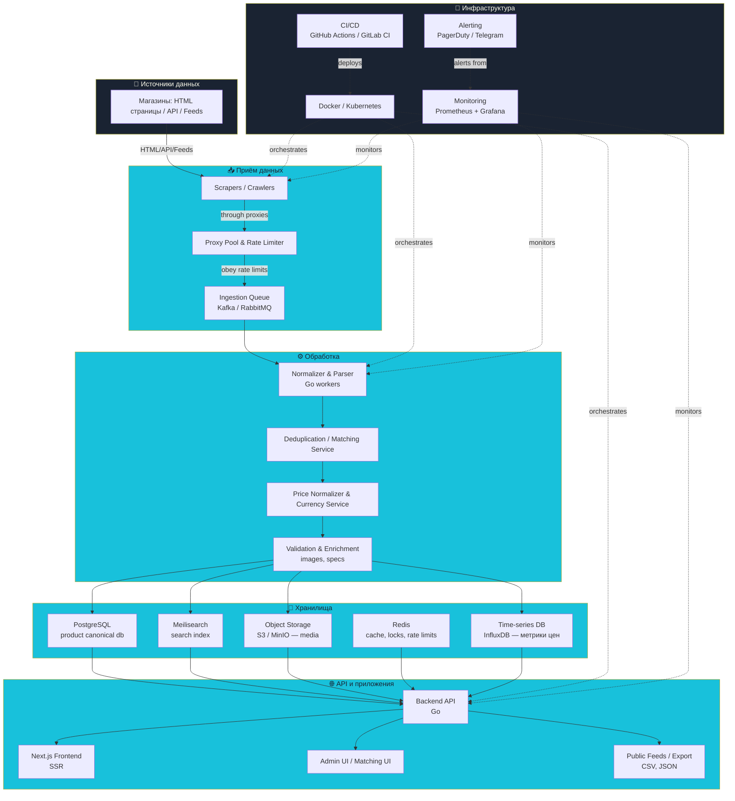

# High-level Data Flow (Высокоуровневая схема потоков данных)

Документ описывает архитектуру потоков данных агрегатора цен Izborator: от сбора информации с сайтов магазинов до выдачи результатов пользователям.

---

## Диаграмма потоков данных

---

## Пояснение по шагам

### 1. Source (🔗 Источники данных)

**Компонент:** Магазины

Магазины предоставляют данные в разных форматах:
- **HTML-страницы** — требуют парсинга
- **Публичные API** — структурированные данные (если доступно)
- **XML/CSV-фиды** — регулярные обновления каталогов

**Задача:** Собрать максимальное количество магазинов для сравнения цен.

---

### 2. Ingestion (📥 Приём данных)

**Компоненты:**
- **Scrapers / Crawlers** — программы для сбора данных с сайтов
- **Proxy Pool & Rate Limiter** — пул прокси и ограничение частоты запросов
- **Ingestion Queue** — очередь сообщений (Kafka / RabbitMQ)

**Процесс:**
1. Scrapers обходят сайты магазинов через прокси
2. Rate Limiter контролирует нагрузку на сайты (избегаем блокировок)
3. Сырые данные отправляются в очередь для устойчивости и масштабирования

**Зачем очередь:** Гарантирует обработку всех данных даже при сбоях, позволяет масштабировать обработку независимо от сбора.

---

### 3. Processing (⚙️ Обработка)

**Компоненты:**
- **Normalizer & Parser (Go workers)** — парсинг и нормализация данных
- **Deduplication / Matching Service** — сопоставление товаров между магазинами
- **Price Normalizer & Currency Service** — нормализация цен и валют
- **Validation & Enrichment** — проверка и обогащение данными (изображения, характеристики)

**Процесс:**
1. Воркеры на Go читают из очереди
2. Парсят и нормализуют структуру данных
3. Выполняют matching — сопоставляют один товар из разных магазинов
4. Нормализуют цены и валюты к одному стандарту
5. Обогащают карточки: загружают изображения в S3, проверяют характеристики

**Критичность:** От точности matching зависит качество сравнения цен.

---

### 4. Storage (💾 Хранилища)

**Компоненты:**

#### D1: PostgreSQL — Canonical DB
- Хранит **канонические карточки товаров** (одна карточка → много магазинов)
- Основная база данных для всех продуктов
- История изменений, метаданные

#### D2: Meilisearch — Search Index
- Быстрый поиск и фильтрация товаров
- Используется для поиска на фронтенде
- Оптимизирован для запросов пользователей

#### D3: Object Storage (S3 / MinIO) — Media
- Изображения товаров
- Документы, PDF-каталоги
- Статические медиафайлы

#### D4: Redis — Cache & Coordination
- Кеширование частых запросов
- Распределённые блокировки
- Rate limiting для API
- Сессии пользователей

#### D5: Time-series DB (InfluxDB) — Price Metrics
- История изменения цен во времени
- Метрики для графиков динамики цен
- Аналитика и отчёты

**Зачем разные хранилища:** Каждое оптимизировано под свою задачу — скорость, тип запросов, объём данных.

---

### 5. API_and_App (🌐 API и приложения)

**Компоненты:**

#### E1: Backend API (Go)
- REST/GraphQL API для фронтенда
- Поиск товаров через Meilisearch
- Карточки товаров из PostgreSQL
- История цен из InfluxDB
- Админ-API для управления

#### E2: Next.js Frontend (SSR)
- Публичный сайт для пользователей
- SSR для SEO (приоритет №3)
- Поиск, категории, фильтры
- Карточки товаров с графиками цен

#### E3: Admin UI / Matching UI
- Панель администратора
- Ручной matching товаров
- Мониторинг парсеров
- Управление магазинами

#### E4: Public Feeds / Export
- Экспорт данных (CSV, JSON)
- API для партнёров
- RSS-фиды для категорий

---

### 6. Infra (🔧 Инфраструктура)

**Компоненты:**

#### F1: Docker / Kubernetes
- Контейнеризация всех сервисов
- Оркестрация и масштабирование
- Упрощение деплоя

#### F2: CI/CD (GitHub Actions / GitLab CI)
- Автоматические тесты
- Автоматический деплой
- Версионирование

#### F3: Monitoring (Prometheus + Grafana)
- Метрики работы всех сервисов
- Dashboards для визуализации
- Отслеживание производительности

#### F4: Alerting (PagerDuty / Telegram)
- Уведомления о проблемах
- Критические алёрты для команды
- Интеграция с мониторингом

---

## Глоссарий терминов

### Ingestion Queue (Очередь приёма)
Очередь сообщений (Kafka, RabbitMQ) для буферизации данных между сбором и обработкой. Гарантирует надёжность и позволяет масштабировать обработку независимо от сбора.

### Canonical DB (Каноническая БД)
База данных с уникальными карточками товаров. Один товар = одна запись, связанная с множеством магазинов и их ценами.

### Matching / Deduplication (Сопоставление / Дедупликация)
Процесс определения, что товары из разных магазинов — это один и тот же продукт. Критично для корректного сравнения цен.

### TS-DB (Time-series Database)
База данных для хранения временных рядов (InfluxDB, Prometheus). Идеальна для истории цен, метрик производительности.

### Proxy Pool (Пул прокси)
Набор прокси-серверов для распределения запросов на сайты магазинов. Помогает избежать блокировок и равномерно распределить нагрузку.

### Rate Limiter (Ограничитель частоты)
Механизм контроля частоты запросов к сторонним сайтам. Предотвращает перегрузку и блокировки со стороны магазинов.

---

## Приоритеты архитектуры

1. **Надёжность** — очередь гарантирует обработку всех данных
2. **Масштабируемость** — независимое масштабирование компонентов
3. **Скорость** — оптимизированные хранилища под разные задачи
4. **Простота** — понятная архитектура для команды из 2 человек

---

## Связанные документы

- [STRATEGY.md](./STRATEGY.md) — стратегия проекта
- [DEVELOPMENT_LOG.md](./DEVELOPMENT_LOG.md) — дневник разработки

